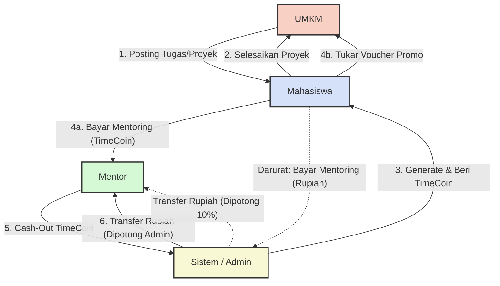

# Dokumentasi Arsitektur Bisnis & Ekosistem Aplikasi
**Sistem:** Hybrid System (Rupiah & TimeCoin)
**Entitas:** Mahasiswa, UMKM, dan Mentor

---

## 1. Pengantar dan Konsep Utama
Aplikasi ini menggunakan **Hybrid System** yang menggabungkan mata uang fiat (Rupiah) dan koin digital (**TimeCoin** / TC). Pendekatan ini bertujuan untuk membangun ekosistem "Belajar & Kerja" yang terintegrasi, mencegah aplikasi menjadi sekadar platform *freelance* konvensional.

### Fungsi Utama TimeCoin (Mata Uang Ekosistem)
TimeCoin berfungsi sebagai mata uang eksklusif untuk edukasi dan *loyalty reward*. Mahasiswa **tidak dapat** membeli TimeCoin secara langsung dengan uang Rupiah.
*   **Syarat Mutlak Mentoring:** TimeCoin digunakan oleh Mahasiswa untuk membayar jasa Mentor, mendorong Mahasiswa untuk menyelesaikan tugas UMKM terlebih dahulu.
*   **Bonus Project Rupiah:** Mahasiswa yang menyelesaikan proyek "Jalur Profesional" (dibayar Rupiah) tetap akan mendapatkan bonus tambahan berupa TimeCoin dari sistem.
*   **Kunci Voucher UMKM:** TimeCoin dapat ditukarkan dengan *voucher* fisik/promo secara spesifik pada UMKM yang proyeknya telah diselesaikan oleh Mahasiswa bersangkutan.

### Peran dan Posisi Mentor
Mentor bertindak sebagai ujung rantai perputaran TimeCoin dan tetap menerima keuntungan finansial yang nyata.
*   **Pencairan TimeCoin (Cash-Out):** Sesi mentoring dibayar menggunakan TimeCoin. Mentor kemudian dapat menukarkan TimeCoin yang terkumpul ke Sistem untuk dicairkan menjadi uang Rupiah (Sistem memotong biaya admin/komisi).
*   **Jalur Mentoring Rupiah (Premium):** Disediakan sebagai jalur darurat. Jika Mahasiswa kehabisan TimeCoin namun membutuhkan bimbingan mendesak, mereka dapat melakukan *booking* Mentor menggunakan uang Rupiah. Sistem akan memotong komisi (misal: 10%) dari transaksi ini.

### Syarat Mahasiswa Menjadi Mentor (*Peer-to-Peer Mentoring*)
Mahasiswa diperbolehkan untuk menjadi Mentor di dalam platform. Namun, sistem memberikan filter/batasan yang ketat agar tidak sembarang orang bisa membuka jasa. Syarat mutlak yang harus dipenuhi:
1.  **Harus Punya Reputasi:** Mahasiswa wajib telah menyelesaikan minimal 5 proyek UMKM di dalam aplikasi dan mendapatkan *rating* yang bagus.
2.  **Syarat Kating (Kakak Tingkat):** Minimal sudah berada di semester atas. Sebagai contoh, mahasiswa Sistem Informasi angkatan 22 yang sudah mahir integrasi Laravel dan Flutter dapat membuka jasa bimbingan untuk adik tingkatnya.
3.  **Ada Bukti Nyata (Portofolio/Akademik):** Wajib mencantumkan bukti yang valid atas keahliannya. Contoh: melampirkan *link* repositori GitHub, desain Figma, atau transkrip yang menunjukkan nilai A khusus untuk materi/mata kuliah yang akan diajarkan.

---

## 2. Alur Kerja (Flow) Ekosistem

Berikut adalah representasi visual dari perputaran uang dan TimeCoin dalam sistem:

**Ringkasan Alur:**
`Mahasiswa kerja ke UMKM` $\rightarrow$ `Dapat Uang/TimeCoin` $\rightarrow$ `Uang ditarik ke ATM Mahasiswa` $\rightarrow$ `TimeCoin dipakai bayar Mentor` $\rightarrow$ `Mentor menukar TimeCoin jadi Rupiah ke Admin`.

---

## 3. Pintu Masuk Pendaftaran (Roles) & Fitur *Switch Mode*

Sistem menyediakan tiga pintu masuk utama yang disesuaikan dengan target pengguna masing-masing:

1.  **Daftar sebagai Mahasiswa:** Target utamanya adalah mahasiswa aktif.
    *   **Syarat:** Wajib mengunggah (upload) KTM yang masih berlaku.
    *   **Fokus Dasbor:** Mencari tugas/proyek dari UMKM dan mengumpulkan portofolio nyata.
2.  **Daftar sebagai Mitra UMKM:** Diperuntukkan bagi pemilik usaha (warkop, fotokopi, *online shop*, dll).
    *   **Syarat:** Wajib mengunggah foto toko/tempat usaha atau produk.
    *   **Fokus Dasbor:** Membuka lowongan/posting kerjaan untuk dikerjakan mahasiswa.
3.  **Daftar sebagai Profesional/Praktisi (Mentor):** Pintu masuk khusus bagi pekerja lepas atau profesional dari luar (*programmer senior*, UI/UX *designer*, dsb).
    *   **Tujuan:** Murni mendaftar sebagai Mentor untuk mencari penghasilan tambahan dengan mengajar mahasiswa.

### Mahasiswa Menjadi Mentor (*Switch to Mentor Mode*)
Bagaimana dengan mahasiswa (Kating) yang ingin menjadi Mentor?
*   Mahasiswa **tetap mendaftar melalui pintu nomor 1** (sebagai Mahasiswa).
*   Setelah mereka memenuhi 3 "Syarat Sakti" (*Peer-to-Peer Mentoring*: minimal 5 proyek selesai, rating bagus, dan bukti portofolio valid), sistem akan memberikan akses khusus.
*   Pada halaman Profil Mahasiswa tersebut akan otomatis muncul tombol *toggle*: **"Switch to Mentor Mode"**. Saat mode ini diaktifkan, profil mereka akan terdaftar di *marketplace* bimbingan dan bisa di-*booking* oleh mahasiswa lain.

---

## 4. Skema Distribusi Awal TimeCoin (Onboarding)

Distribusi koin awal dirancang untuk menjaga keseimbangan ekonomi ekosistem dan mencegah inflasi.

| Entitas | Saldo Awal | Syarat & Kondisi | Tujuan / Penggunaan |
| :--- | :---: | :--- | :--- |
| **Mahasiswa** | **0 TC** | Mendapat *Welcome Bonus* (misal: 5 TC) **HANYA JIKA** akun terverifikasi (upload foto KTM/identitas valid). | Cukup untuk menukar 1 voucher kopi atau *booking* Mentor pemula untuk 1 sesi pendek. |
| **UMKM** | **20 TC** | Diberikan secara otomatis saat pendaftaran. Bertindak sebagai *Social Quota* bulanan. | Modal awal agar UMKM bisa langsung membuat proyek "Jalur Barter" tanpa keluar biaya. |
| **Mentor** | **0 TC** | **Mutlak 0 TC.** Tidak ada bonus pendaftaran. | Mentor adalah pihak yang mencairkan TC ke Rupiah. Mereka harus mencari koin secara organik dari Mahasiswa. |

---

## 5. Skema Monetisasi dan Upgrade Premium

Setiap entitas memiliki cara dan keuntungan tersendiri untuk melakukan *upgrade* ke level Premium. Skema ini dirancang untuk menjaga *User Retention* dan mengamankan arus kas (*Monetization*) aplikasi.

### A. Sisi UMKM (Sumber Pendapatan Utama)
UMKM adalah penyumbang finansial utama untuk platform (sebagai *demand/employer*).
*   **Freemium (Gratis):** Dibatasi hanya dapat *posting* tugas di "Jalur Barter" dengan batas 20 TC per bulan. Jika habis, harus menunggu siklus bulan berikutnya.
*   **Premium (Berbayar Rupiah):** Berlangganan bulanan (contoh: Rp50.000/bulan) melalui Payment Gateway.
*   **Keuntungan Premium:** 
    *   Mendapat lencana *Verified Partner*.
    *   Kuota TimeCoin bulanan yang jauh lebih besar.
    *   **Akses Eksklusif:** Membuka fitur **"Cash Task"** (membayar proyek dengan uang tunai Rupiah) untuk merekrut mahasiswa talenta terbaik (*Top Tier*).

### B. Sisi Mahasiswa (Gamifikasi & Reputasi)
Mahasiswa adalah penggerak aktivitas platform. Mereka **dilarang** dipungut biaya (*subscription*).
*   **Freemium (Standard):** Hanya dapat mengambil proyek "Jalur Barter".
*   **Premium (Jalur Prestasi):** Naik level menjadi **"Top Talent"** berbasis Poin Reputasi, BUKAN uang. Syarat: Menyelesaikan 5 tugas dengan *rating* bintang 5 dari UMKM.
*   **Keuntungan Premium (Top Talent):** 
    *   Prioritas notifikasi untuk proyek-proyek besar.
    *   **Akses Eksklusif:** Diizinkan mengambil proyek dari UMKM yang dibayar menggunakan uang tunai (**Cash Task**).

### C. Sisi Mentor (Visibilitas & Efisiensi)
Mentor mencari keuntungan dari platform dengan menjual keahlian mereka.
*   **Freemium (Standard):** Bebas membuka jasa bimbingan. Namun, potongan biaya admin saat proses *Cash-Out* TimeCoin ke Rupiah cukup besar (contoh: **15%**).
*   **Premium (Berbayar Rupiah / Potong Saldo):** Membeli status **"Featured Mentor"**.
*   **Keuntungan Premium:** 
    *   Profil ditempatkan di halaman utama/teratas (*highlight*) saat pencarian mentor.
    *   Potongan biaya admin untuk pencairan (*Cash-Out*) ditekan/turun drastis menjadi hanya **5%**.
